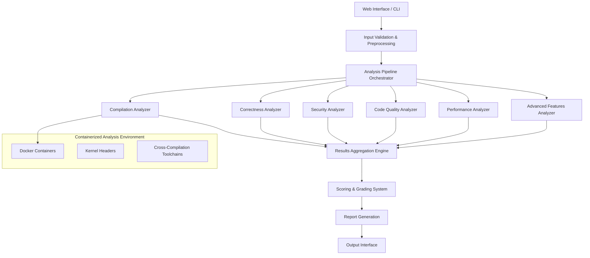

# Linux Driver Evaluation Framework

A comprehensive system for evaluating Linux device driver code quality through automated static analysis, compilation testing, and multi-dimensional assessment.

## System Architecture

### High-Level Design



### Major Components

- **Web Interface**: FastAPI-based web application with file upload and real-time progress tracking
- **Analysis Pipeline**: Orchestrates six specialized analyzers with parallel execution and timeout management
- **Compilation Analyzer**: Docker-based cross-architecture compilation testing with kernel header integration
- **Static Analysis Tools**: Clang Static Analyzer, Coccinelle, Flawfinder integration for comprehensive code analysis
- **Scoring System**: Weighted scoring with configurable thresholds and grade assignment
- **Report Generation**: JSON, HTML, and PDF report formats with detailed findings and recommendations

## Evaluation Rubrics

The framework evaluates driver code across five key dimensions with weighted scoring:

### Scoring Weights
- **Correctness (40%)**: Semantic correctness, API usage, and logic errors
- **Security (25%)**: Vulnerability detection, buffer overflows, and privilege escalation risks
- **Code Quality (20%)**: Coding standards, maintainability, and documentation coverage
- **Performance (10%)**: Algorithmic efficiency, memory patterns, and I/O optimization
- **Advanced Features (5%)**: Power management, device tree integration, and interrupt handling sophistication

### Grade Thresholds
- **A (90-100%)**: Excellent implementation with minimal issues
- **B (80-89%)**: Good implementation with minor improvements needed
- **C (70-79%)**: Acceptable implementation with moderate issues
- **D (60-69%)**: Below average implementation requiring significant improvements
- **F (0-59%)**: Poor implementation with critical issues requiring major rework

### Important: Findings-Based Evaluation Approach

The framework uses a **findings-based scoring system** rather than simple metric aggregation, providing more accurate and flexible evaluation:

#### Why Findings Over Raw Metrics
Instead of using granular weights for raw metrics like:
```json
"compilation": {
  "success_rate": 0.85,
  "warnings_count": 12, 
  "errors_count": 3
}
```

The system generates **individual findings** with severity levels:
```json
"findings": [
  {
    "type": "compilation_error",
    "severity": "HIGH",
    "message": "Undefined reference to 'kmalloc'",
    "recommendation": "Include appropriate header file"
  }
]
```

#### Advantages of Findings-Based Approach

**Preserves severity context**: A critical security vulnerability impacts scores more than multiple style warnings. Raw error counts treat all issues equally - findings don't.

**Flexible penalties**: Critical issues cost 20 points, high-severity 10 points, minor issues 0.5 points. Your score reflects real-world impact, not just quantity.

**Actionable results**: Instead of "12 compilation errors," you get specific problems with exact locations and fix recommendations.

**Smart aggregation**: Multiple analyzers can find overlapping issues. The system automatically deduplicates and resolves conflicts.

**Easy scaling**: New analyzers just assign severity levels to their findings - no scoring system restructuring needed.

### Evaluation Criteria

#### Correctness (40% weight)
- **Compilation Success**: Clean compilation without errors across target architectures (x86_64, RISC-V)
- **Build System Integration**: Proper kernel module structure and Makefile compatibility
- **Kernel API Compatibility**: Correct usage of kernel APIs for target kernel versions
- **Memory Safety**: Null pointer dereferences, use-after-free, memory leaks
- **API Usage**: Proper kernel API usage patterns and error handling
- **Logic Errors**: Division by zero, uninitialized variables, unreachable code
- **Resource Management**: Proper allocation/deallocation pairing

*Note: Compilation contributes 40% to this dimension's score, with semantic analysis contributing the remaining 60%*

#### Security (25% weight)
- **Buffer Overflows**: Dangerous function usage and unchecked operations
- **Input Validation**: Proper validation of user-space data
- **Race Conditions**: Concurrency issues and locking problems
- **Privilege Escalation**: Capability usage and credential management

#### Code Quality (20% weight)
- **Coding Standards**: Linux kernel style compliance (checkpatch.pl)
- **Complexity**: Cyclomatic complexity and maintainability metrics
- **Documentation**: Kernel-doc style documentation coverage
- **Consistency**: Formatting, naming, and structural consistency

#### Performance (10% weight)
- **Algorithmic Efficiency**: Nested loops and complexity analysis
- **Memory Patterns**: Allocation efficiency and leak detection
- **I/O Operations**: Hardware access patterns and delay usage
- **Resource Usage**: DMA usage and hardware resource management

#### Advanced Features (5% weight)
- **Power Management**: Suspend/resume, runtime PM, clock/regulator management
- **Device Tree**: DT bindings, property parsing, resource extraction
- **Interrupt Handling**: Threaded IRQs, shared interrupts, advanced flags

For detailed analyzer documentation, see [docs/analyzer-documentation.md](docs/analyzer-documentation.md) which outlines each analyzer's functionality, technology stack, and coverage areas.

## Usage

### Prerequisites
- Python 3.8+
- Docker (required for compilation analysis)
- Linux environment (recommended)

### Setup

1. **Clone the repository**
   ```bash
   git clone <repository-url>
   cd linux-driver-evaluation-framework
   ```

2. **Run the automated setup**
   ```bash
   python setup.py
   ```
   
   This comprehensive setup script will:
   - ✅ Check system requirements (Python 3.8+, Docker)
   - 📦 Install Python dependencies automatically
   - ⚙️ Initialize configuration files
   - 📝 Create example driver files for testing
   - 🐳 Build Docker images for all supported architectures
   - 🧪 Run verification tests to ensure everything works

   The setup process takes 10-20 minutes depending on your internet connection (Docker image building).

### Running the Web Application

1. **Start the web server**
   ```bash
   python run_web_server.py
   ```
   
   The server will start at `http://127.0.0.1:8000`

### Using the Web Interface

1. **Access the application**
   - Open your browser to `http://127.0.0.1:8000`
   - You'll see the main evaluation interface

2. **Upload driver code**
   - Click "Choose Files" or drag and drop your `.c` and `.h` files
   - Supported formats: C source files, header files
   - Maximum file size: 10MB per file

3. **Configure analysis**
   - **Kernel Version**: Select target kernel version (5.4, 5.15, 6.1, 6.6)
   - **Architecture**: Choose target architecture (x86_64, RISC-V)

4. **Start evaluation**
   - Click "Start Evaluation"
   - Monitor real-time progress with status updates
   - View detailed progress for each analyzer

5. **Review results**
   - **Overall Score**: Weighted score and letter grade
   - **Dimension Scores**: Individual scores for each evaluation dimension
   - **Findings**: Detailed list of issues with severity levels and recommendations

6. **Export reports**
   - **JSON**: Machine-readable format for integration
   - **HTML**: Formatted report for viewing and sharing
   - **PDF**: Professional report format for documentation

### Configuration

The system uses `config/default.json` for default settings.


## Bonus Challenges

1. **Multi Kernel - Multi Arch evaluation**
   - **Current Approach**
      - Retrieve a specific kernel version and arch from *default.json*
      - Pass these as args to Dockerfile.template and build a docker image with custom kernel version and arch for compilation step
      - For Multi Arch: Relevant packages are installed during build, Relevant compilation flags are passed in compilation.py (refactor: compile command builder class)
   - **Scaled Approach**
      - To run multiple cases of kernel and arch compilations, upgrades would include maintaining kernel-arch deps, and parrallel scheduling of evaluation
      - Maintain a build matrix, mapping archs to toolchain, base_image, kernel headers
      - Use CI matrix to spawn N = (#kernels × #archs) parallel jobs and Buildx cache for caching image layers

2. **Runtime Testing**
   - **Proposed Solution**
      - Since docker inherently uses host kernel environment, one can only test compilation for different kernel version. Module operations such as *insmod* are not compatible across kernels.
      - Long-term solution: maintain a Kubernetes cluster with worker node pools, each pool pinned to a specific kernel version and architecture.
      - After CI build, a second pipeline stage schedules test jobs onto the corresponding node pool.

3. **Regression Testing**
   - **Proposed Solution**
      - Trigger on kernel updates: Moniter kernel RSS feed via GitHub Actions or Jenkins that periodically queries for new kernel versions.
      - Adding a new kernel to the existing pipeline: Support adding new entry to build matrix using REST Apis.

4. **Model Finetuning: Feedback Loop Design**
   - Dataset Prep: Create an initial data store with following values
      ```json
      {
      "prompt": "...",
      "generated_code": "...",
      "score_vector": {"security": 0.8, "compilation": 0.9, "quality": 0.6},
      "reward": 0.7 //weighted sum of score_vector 
      }
      ```
   - RLHF Fine-Tuning: using HuggingFace transformers + trlx
      - Sample a prompt from a set of options
      - LLM generates generated_code
      - Pass the code through evaluation engine to get score_vector → compute reward
      - Feed reward back to PPO to update model weights
      - Repeat for multiple epochs/batches
   - Pros: Directly optimizes based on reward value, produces quick results

5. **Scaling with an LLM pipeline**
   - The pipeline naturally parallelizes across matrix cells: multiple kernels × multiple architectures × multiple code variants generated by the LLM.
   - Need more information about exact end goal of the ps to decide scaling specifics

## Coding Agent Usage
   - I used Kiro's spec based approach to build this project.
   - Ideation: 
      - Kiro generates requirements -> design -> tasks for a given problem statement. 
      - Issues involve the agent generating an exhagerating project scope and complicating the design. Requiring manual tweaking and intervention in ~40% cases.
   - Implementation:
      - Kiro uses Claude Sonnet 4, creating apt source code templates for most of the given prompts.
      - Issues involve lacking coherence to original ps, requiring manual cleanup on generated code and integration with existing modules in ~20% cases.

   *Note: The agent often assumes instructions for vague tasks. For this project, it included filling knowledge gaps about linux driver code. While definitely not recommended for production systems, it creates quick appealing solutions for demo/take-home tasks like these.*