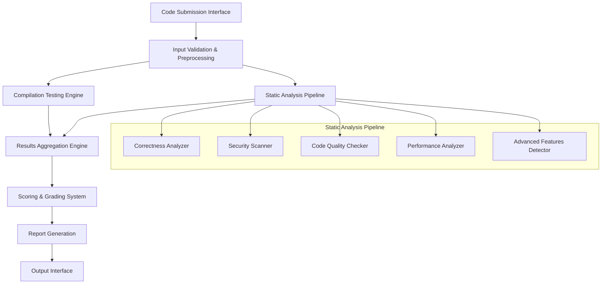

# Architecture

## High-Level Architecture

## System Components

1. **Code Submission Interface**: Web-based interface and CLI tool for code submission
2. **Input Validation & Preprocessing**: Validates driver code and prepares it for analysis
3. **Compilation Testing Engine**: Tests code compilation against kernel headers
4. **Static Analysis Pipeline**: Orchestrates multiple analysis tools
5. **Results Aggregation Engine**: Collects and normalizes results from all analyzers
6. **Scoring & Grading System**: Applies weighted scoring algorithm
7. **Report Generation**: Creates comprehensive evaluation reports
8. **Output Interface**: Delivers results via web interface, API, or file export
